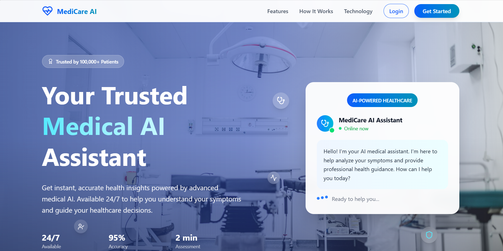
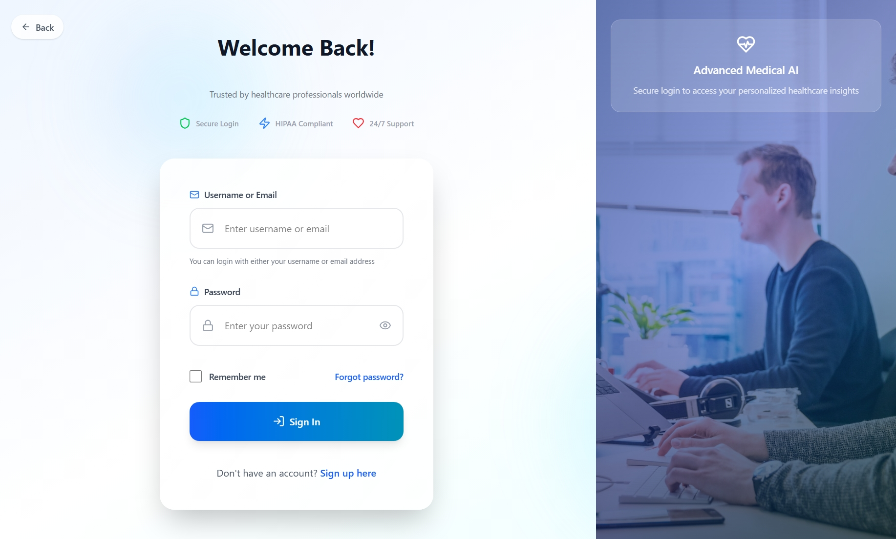
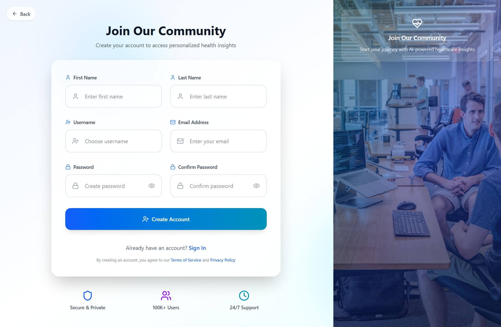
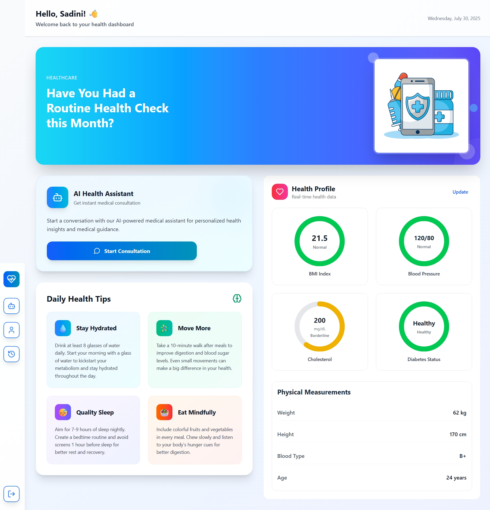
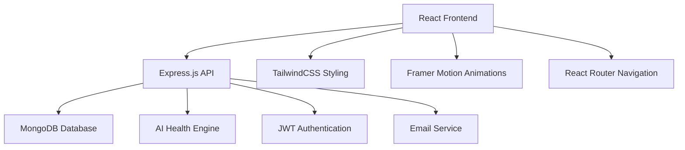

# 🏥 AI Health Diagnosis Chatbot


## 🌟 Features

### 🤖 **AI-Powered Health Assistant**
- **Intelligent Diagnosis**: Advanced AI chatbot for symptom analysis and health guidance
- **Real-time Consultation**: Instant medical advice and health recommendations
- **Multi-symptom Analysis**: Comprehensive health assessment based on multiple symptoms

### 📊 **Health Dashboard**
- **Visual Health Metrics**: Modern circular progress charts for BMI, blood pressure, cholesterol, and diabetes status
- **Real-time Monitoring**: Live health data visualization and tracking
- **Personalized Insights**: Customized health recommendations based on user profile

### 👤 **User Management**
- **Secure Authentication**: JWT-based authentication with bcrypt password hashing
- **Health Profile Management**: Comprehensive user health data management
- **Consultation History**: Complete record of past medical consultations

### 🎨 **Modern UI/UX**
- **Responsive Design**: Mobile-first approach with seamless cross-device experience
- **Smooth Animations**: Framer Motion powered animations for enhanced user experience
- **Clean Interface**: Modern, intuitive design with TailwindCSS styling

---

<br/>

<div align="center">





<br/>


<br/>




<br/><br/>





<br/>
<br/>



</div>
<br/>


## 🏗️ Architecture



---
## 🛠️ Tech Stack

### **Frontend**
- **React 19** - Modern UI library with latest features
- **Vite** - Lightning-fast build tool and development server
- **TailwindCSS 4.1** - Utility-first CSS framework
- **Framer Motion 12** - Production-ready motion library
- **React Router 7** - Declarative routing for React
- **Lucide React** - Beautiful, customizable SVG icons
- **Axios** - Promise-based HTTP client

### **Backend**
- **Node.js** - JavaScript runtime environment
- **Express.js** - Fast, unopinionated web framework
- **MongoDB Atlas** - Cloud-native database service
- **Mongoose** - Elegant MongoDB object modeling
- **JWT** - Secure token-based authentication
- **bcryptjs** - Password hashing and security
- **Nodemailer** - Email sending capabilities

### **Development & Security**
- **ESLint** - Code linting and quality assurance
- **Helmet.js** - Security middleware for Express
- **CORS** - Cross-origin resource sharing
- **Rate Limiting** - API protection against abuse
- **Environment Variables** - Secure configuration management

---
<br/>

## 📁 Project Structure

```
HealthAIChatBot/
├── 📁 backend/                 # Node.js Express API
│   ├── 📁 config/             # Database and app configuration
│   ├── 📁 controllers/        # Request handlers and business logic
│   ├── 📁 middleware/         # Authentication and security middleware
│   ├── 📁 models/             # MongoDB schemas and models
│   ├── 📁 routes/             # API route definitions
│   ├── 📁 services/           # Business logic and external services
│   ├── 📄 server.js          # Application entry point
│   └── 📄 package.json       # Backend dependencies
│
├── 📁 frontend/               # React application
│   ├── 📁 public/            # Static assets
│   ├── 📁 src/               # Source code
│   │   ├── 📁 components/    # Reusable UI components
│   │   ├── 📁 context/       # React context providers
│   │   ├── 📁 pages/         # Page components
│   │   ├── 📁 services/      # API calls and external services
│   │   ├── 📁 utils/         # Utility functions
│   │   └── 📄 main.jsx      # Application entry point
│   ├── 📄 index.html        # HTML template
│   ├── 📄 package.json      # Frontend dependencies
│   └── 📄 vite.config.js    # Vite configuration
│
├── 📄 README.md              # Project documentation
├── 📄 .gitignore            # Git ignore rules
└── 📄 LICENSE               # MIT License
```

---

<br/>

### 1. **Authentication System**
- User registration and login
- JWT-based secure authentication
- Password encryption with bcrypt
- Protected routes and middleware

### 2. **Health Dashboard**
- Real-time health metrics visualization
- Interactive circular progress charts
- BMI calculation and categorization
- Blood pressure monitoring
- Cholesterol level tracking
- Diabetes status assessment

### 3. **AI Chatbot**
- Natural language processing for symptoms
- Intelligent health recommendations
- Conversation history tracking
- Multi-turn conversation support

### 4. **User Profile Management**
- Comprehensive health profile creation
- Medical history tracking
- Personal information management
- Profile picture upload (if implemented)

---
<br/>


## 📚 API Documentation

### Authentication Routes
```http
POST /api/auth/register    # User registration
POST /api/auth/login       # User login
POST /api/auth/logout      # User logout
GET  /api/auth/profile     # Get user profile
PUT  /api/auth/profile     # Update user profile
```

### Health Routes
```http
GET  /api/health/profile   # Get health profile
PUT  /api/health/profile   # Update health profile
GET  /api/health/metrics   # Get health metrics
```

### Chat Routes
```http
POST /api/chat/message     # Send chat message
GET  /api/chat/history     # Get chat history
DELETE /api/chat/history   # Clear chat history
```

---
<br/>


<div align="center">

**⭐ Star this repo if you find it helpful!**

Made with ❤️ by [Sadini Wanniarachchi](https://github.com/SadiniWanniarachchi)

</div>
